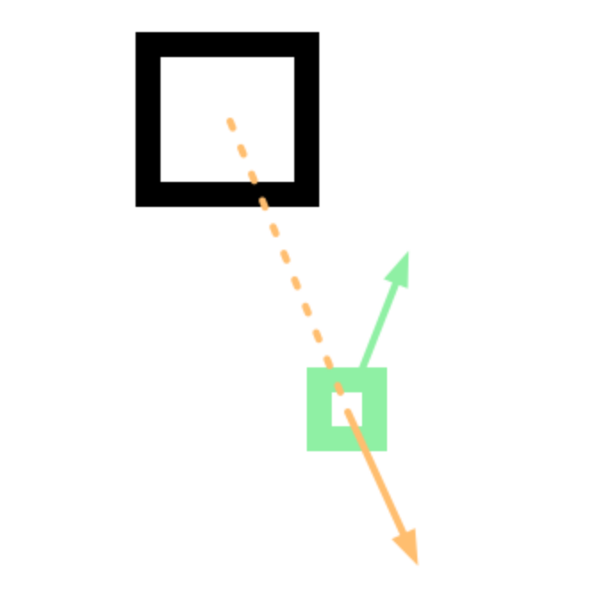

# Note of Thinking

## Part 2

### Feel Feature

> Make the small squares flee away from the bigger ones
>
> All squares tend to keep a certain randomness to their behaviour / trajectory

First, during each update, detect if there are anyone else around the square.

Set a limit that how small squares will flee, and how close the small ones flee distance with not smalls.

Write a function to do that.

#### Problem

I don't know how to count the distance between each squares, and we should do it efficiently

#### From Class

Flee direction

