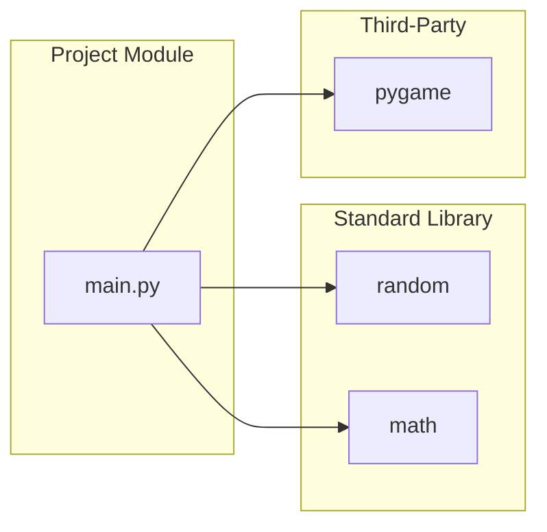
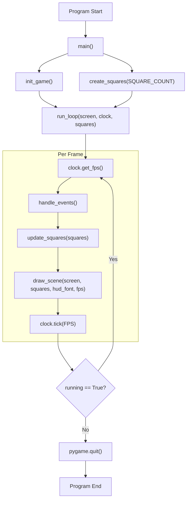
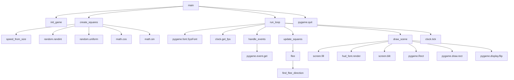

# Project Architecture

This document describes the architecture of the `lab8-pygame` project based on `main.py`.

## 1) Module Dependency Graph



`main.py` imports only `random`, `math`, and `pygame`.

## 2) High-Level Runtime Flow



The frame loop continues while `handle_events()` keeps `running` true.

## 3) Function-Level Call Graph



Internal logic centers around movement (`update_squares`) and behavior (`flee`/`find_flee_direction`).

## 4) Primary Execution Sequence Diagram

```mermaid
sequenceDiagram
    participant U as "User"
    participant App as "Python Process"
    participant Main as "main()"
    participant Init as "init_game()"
    participant Create as "create_squares()"
    participant Loop as "run_loop()"
    participant Events as "handle_events()"
    participant Update as "update_squares()"
    participant Flee as "flee()"
    participant Find as "find_flee_direction()"
    participant Draw as "draw_scene()"
    participant PG as "pygame"

    U->>App: "Run script"
    App->>Main: "Enter main()"
    Main->>Init: "Initialize display + clock"
    Init->>PG: "init, set_mode, set_caption, Clock"
    PG-->>Init: "screen, clock ready"
    Init-->>Main: "screen, clock"

    Main->>Create: "Create squares"
    Create->>PG: "No direct call"
    Create-->>Main: "squares list"

    Main->>Loop: "Start frame loop"

    loop "While running is True"
        Loop->>Events: "Poll input"
        Events->>PG: "event.get()"
        alt "QUIT or ESC/Q pressed"
            Events-->>Loop: "False"
        else "No exit event"
            Events-->>Loop: "True"
        end

        Loop->>Update: "Move and bounce squares"
        loop "For each square"
            Update->>Update: "Apply velocity + boundary checks"
        end
        loop "For each square (behavior pass)"
            Update->>Flee: "Adjust velocity when threatened"
            Flee->>Find: "Find nearest larger square in range"
            Find-->>Flee: "direction or None"
            Flee-->>Update: "updated velocity"
        end
        Update-->>Loop: "state updated"

        Loop->>Draw: "Render frame"
        Draw->>PG: "fill, text render, rect draw, display.flip"
        Draw-->>Loop: "frame presented"

        Loop->>PG: "clock.tick(FPS)"
    end

    Loop-->>Main: "Exit loop"
    Main->>PG: "pygame.quit()"
    Main-->>App: "Process exits"
```

## Assumptions

- Architecture is inferred from `main.py` only.
- There are no additional local modules involved in runtime flow.
- The primary path is normal startup, repeated frame loop, and graceful quit via window close or `Esc`/`Q`.

